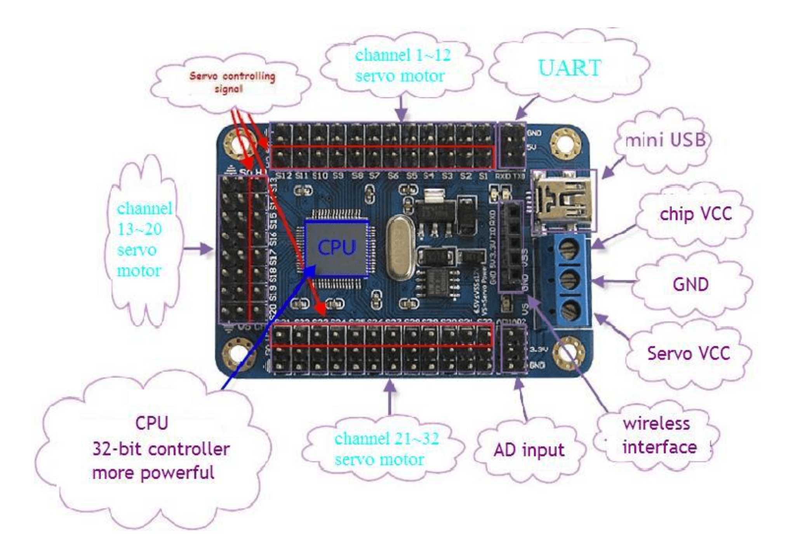

# Robot
19 DOF Humanoid Robot programmed in Ruby

# Hardware used
```
- Raspberry pi 
- 32ch-servo controller
- 19 Servo Motors (MG 996R)
- Jumper Wires (female to female & male to female)
- 5inch TFT Display
- Mini Hdmi cable
- Pi Camera
- Speaker with mic
- Portable Powerbank (Capacity:6000 mAh & Output:5V)
- Power Supply 
 - raspberry pi 5v
 - servo controller 3v
```

# Connection Instructions




**Refer above images for pin numbers**

```
1. Connect pin#2 in Raspberry pi to servo VCC of servo controller
2. Connect pin#4 in Raspberry pi to chip VCC of servo controller
3. Connect pin#6 in Raspberry pi to GND of servo controller
4. Connect pin#8(TXD0) in Raspberry pi to RXD of servo controller
5. Connect pin#10(RXD0) in Raspberry pi to TXD of servo controller
6. Connect Servo Motors to Servo Controller channels (1-32ch)

```


# Steps for Serial Cummunication with Raspberry Pi Using UART
Step 1:
```
sudo raspi-config
```
Expand filesystem and enable serial on advanced page, exit and reboot.

Step 2: Disable the bluetooth 
```
sudo nano /boot/config.txt

dtoverlay=pi3-disable-bt
 ```
Step 3: reboot PI
```
sudo reboot
```
Step 4: edit cmdline.txt
```
sudo nano /boot/cmdline.txt
```
change to the following:
```
dwc_otg.lpm_enable=0 console=tty1 console=ttyAMA0,115200 root=/dev/mmcblk0p2 rootfstype=ext4 elevator=deadline fsck.repair=yes rootwait
```
STep 5: Reboot Pi

```
sudo reboot
```

